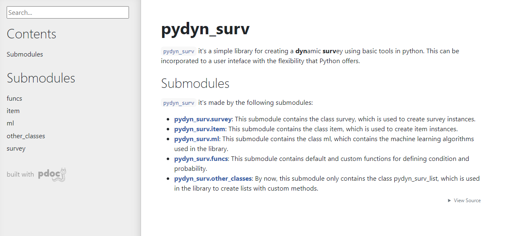
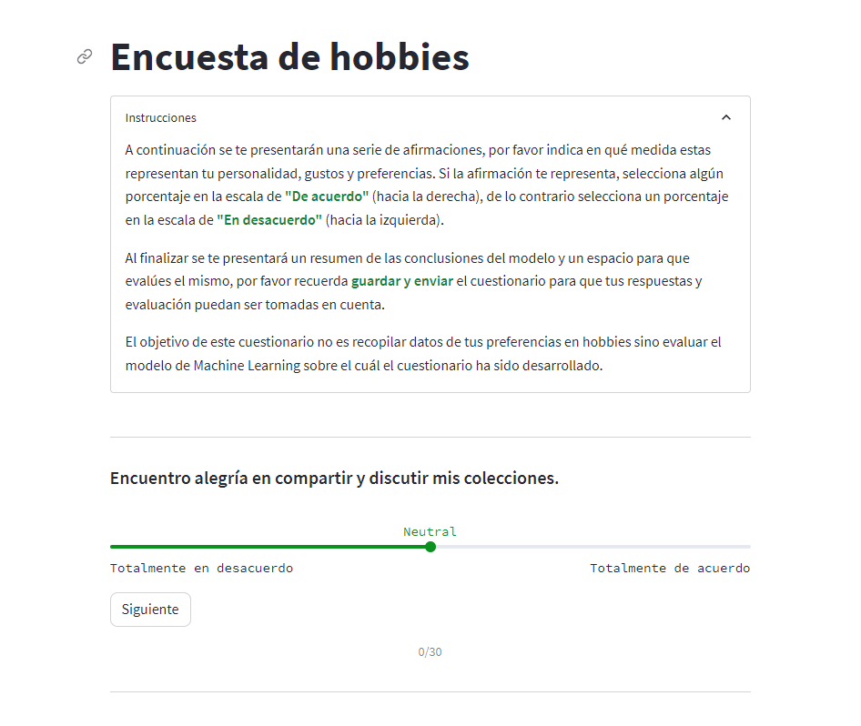

# pydyn_surv

`pydyn_surv` it's a library for creating a **dyn**amic **surv**ey using basic tools in python. This can be incorporated to a user inteface with the flexibility that Python offers.

## The model
The model consists of a recommender system based on previous answers. The details of the same are explained in the [thesis](thesis_spanish.pdf) document.

## Documentation

You can find the [user documentation page over here.](https://jara99.github.io/Dynamic_Survey_lib/)

[](https://jara99.github.io/Dynamic_Survey_lib/)

## Installation

You can install the library by simply cloning the repository somewhere in your computer and using `pip` to install it:

```bash
git clone https://github.com/JARA99/Dynamic_Survey_lib.git
pip install ./Dynamic_Survey_lib
```

## Usage example
You can try the library capacities by looking at the app built on streamlit: [pydyn-surv-hobbies-test](https://pydyn-surv-hobbies-test.streamlit.app/). The source code for it is located inside the `examples` folder on [examples/hobbies_survey/](examples/hobbies_survey/).

[](https://pydyn-surv-hobbies-test.streamlit.app/)